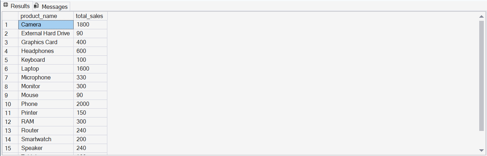
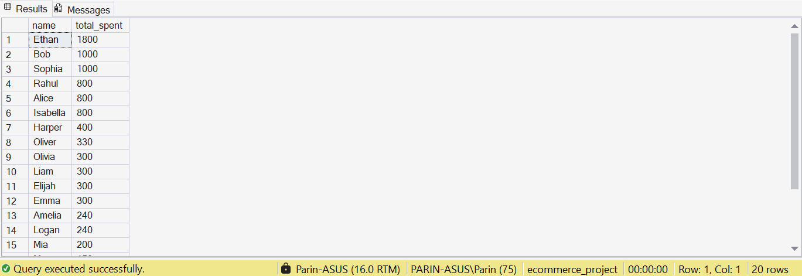
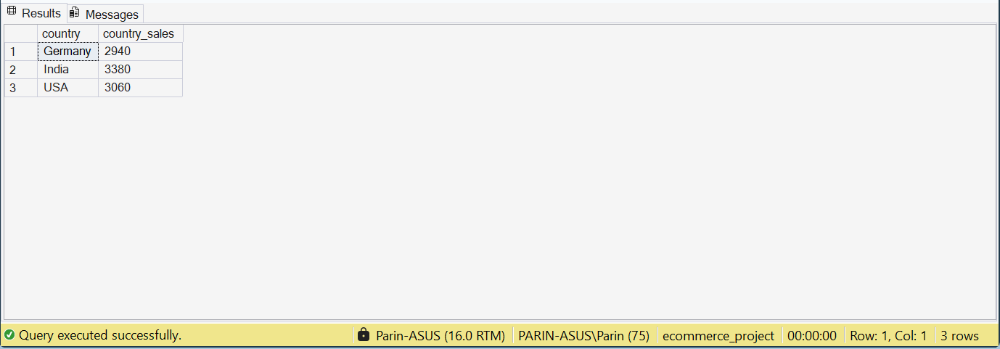

# E-Commerce Sales Analysis using SQL

This project demonstrates how SQL can be used to analyze sales data of an online store.

## Features
- total sales per product
- top customers by spending
- sales by country

## Files
- database_schema.sql -> database structure
- sample_data.sql -> sample dataset
- sales_analysis.sql -> analysis queries
## Query Results

### Total Sales Per Product

### Top Customers

### Sales by Country

